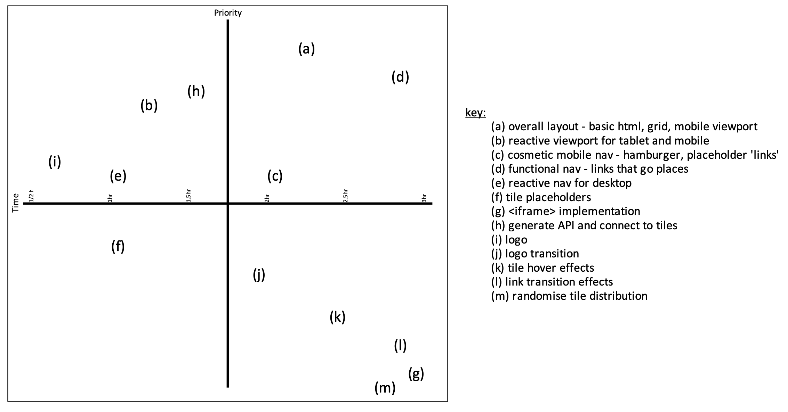

# portfolio-landing

# Project Overview

## Project Schedule

|  Day | Deliverable | Status
|---|---|---|
|Day 0| Project Description | Incomplete
|Day 0| Wireframes / Priority Matrix / Timeline | Incomplete
|Day 1| Core Application Structure (HTML, CSS, etc.) | Incomplete
|Day 2| API and Links| Incomplete
|Day 2| Reactive Structure | Incomplete
|Day 3| MVP & Bug Fixes | Incomplete
|Day 3| Transition Effects| Incomplete
|Day 4| Final Touches | Incomplete
|Day 4| Present | Incomplete

## Project Description

###### I have two main concepts that I'd like to integrate, though I'm concerned #2 may be too big of a bite at this time in my studies:
1. I would like my portfolio landing page to be a a dynamic onesheet, using links, transitions, and maybe an iframe or two in place of scrolling
2. ~~I want to try to implement non-rectangular or even trapezoidal design using some combination of transform:skew/rotate and clip-path. Doing this in conjunction with reactive design as well as grid and flexbox will be... a challange.~~
3. After a lot of concept research time, we're gonna stick with a (probably) parallelogram design. Short term goal: 'randomly' destributed tiles on a grid. Long term: actually randomise the tile positions with each reaload. Checkerboard kinda idea.


## Portfolio I want to Emulate

Link To Site  | One Thing I'd Like To Incorporate | 
| ------------- | ------------- |
| [https://www.marcomarino.design/project.html](https://www.marcomarino.design/project.html) | onesheet without scrolling. minimalist |
|[https://designthat.works/project/hykoo](https://designthat.works/project/hykoo) | landing page with lots of negative space |
| [https://codepen.io/hexagoncircle/pen/yOwvQV](https://codepen.io/hexagoncircle/pen/yOwvQV) |  `skewed` flexbox with hover effects |


---

## Wireframes

[Wireframe Link](https://res.cloudinary.com/scwd/image/upload/v1626100626/Portfolio_Wireframe_luqs8k.png)

## Time/Priority Matrix 
###### List of features:
* a) Checkerboard grid (mobile first)
  - b) Reactive: Phone size 3x6 squares. Larger viewports = more squares.
* c) Hamburger for mobile, which will populate navbar to grid squares.
* d) functional nav links
  - about me, contact form, linkedin, resume
* e) "nav" for larger format will be links dispersed on the checkerboard
* f) project placeholders/previews (snapshots first)
  - g) long term iframe based tiles that transition to fill the screen.
* h) Generate API (placeholder first... need projects!)
* i) Initial logo ('blankSpace')
  - j) display on white sheet then transition effect to checkerboard
* k) hover effects over each tile.
* l) Transition effects for clicking tiles.
* m) Loooow priority - randomly assigned tile positions.




### MVP/PostMVP

#### MVP
- Functional Nav
- Contact Me form
- About Me section
- Project API Structure
- Project Cards/Links
- Reactive Layout
- Logo

#### PostMVP 
- Transition Effects
- Card Hover Effects
- iframs?
- Random Tile algo


## Functional Components

#### MVP
| Component | Priority | Estimated Time | Actual Time |
| --- | :---: |  :---: | :---: | 
| Initial HTML+CSS Grid | H | 2hr | ?? |
| Hamburger Nav         | H | 2hr | ?? |
| Contact Me Form       | M | 2hr | ?? |
| About Me Page         | M | 2hr | ?? | 
| Responsive CSS        | H | 1hr | ?? |
| Regular Nav           | H | 1hr | ?? |   
| Generating API        | H | 2hrs| ?? | 
| Social Media Icons    | L | 1hr | hr |
| Total                | - | 11hrs| hrs |

#### PostMVP
| Component | Priority | Estimated Time | Actual Time |
| --- | :---: |  :---: | :---: | 
| Tile Hover Effects | L | 2hr | ?? |
| Card Transition Effects | ML | 2hr | ?? |
| Nav Transition Effects | M | 2hr | ?? |
| Tile Randomiser | L | 3hr | ?? | 
| iframes | L | 3hr | ?? |
| Total | H | 20hrs| hrs |


## Additional Libraries
 At the moment probably only jQuery.


## Code Snippet

Use this section to include a brief code snippet of functionality that you are proud of an a brief description  
```
function reverse(string) {
	// here is the code to reverse a string of text
}
```


## Issues and Resolutions
 Use this section to list of all major issues encountered and their resolution.


#### SAMPLE.....
**ERROR**: app.js:34 Uncaught SyntaxError: Unexpected identifier                                
**RESOLUTION**: Missing comma after first object in sources {} object